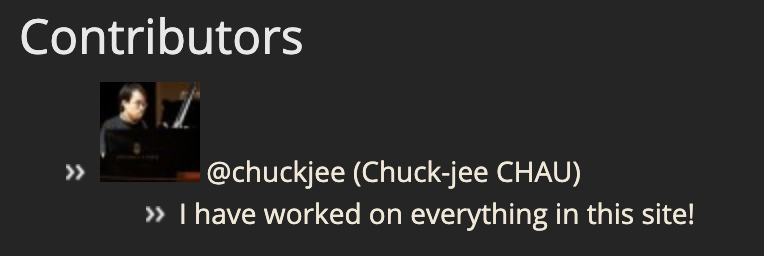

# Task 4: Show your team to the Internet

You are going to update this web page: `https://csci3251-2021.github.io/_(repo name)_`

Here are your tasks:
1. Edit **`readme.md`**
2. Under **Contributors**, use a loop in the folder `_stu` (Jekyll collection `stu`) to go through all files
3. Show these information from the files:
  * image
  * user
  * name
  * content
4. Arrange the contents so that it looks like this:\ 

  
* The user name should be a link towards the user profile, for example @chuckjee should point to https://github.com/chuckjee

* Everyone in your team should add their information to corresponding md files in the `_stu` folder

(Feel free to enhance the page outlook by changing the theme, or preparing new CSS!)

_You may find this page useful: https://jekyllrb.com/docs/collections/#add-content_

GitHub Page is a great tool for developers, learn more here: https://lab.github.com/githubtraining/github-pages
